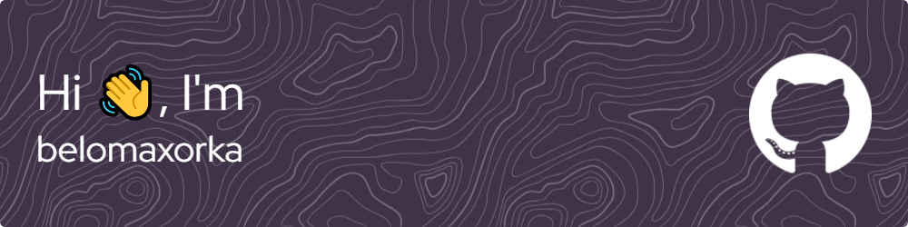

[](https://stand-with-ukraine.pp.ua)

```php
while ($this->proccessLifeIsRunning) {
    $this->getUp();
    $this->eating();
    $this->coding();
    $this->eating();
    $this->sleep(32400);
}
```

<hr>

### 🧒 About me:

* 👂 My name is Roman Kelesidis
* 🌎 I speak Russian (Native), English
* 🌠 I was born in Greece
* 🎉 17 y.o developer (25.05.2006)
* 🔭 I’m currently working at home 💀
* 📖 I love learning something new
* 💞️ I'm looking to collaborate on open-source

<hr>

### 📫 How to reach me:

<a href="mailto:roman25052006.kelesh@gmail.com" rel="nofollow"></a>
<a href="https://t.me/belomaxorka" rel="nofollow"></a>

<hr>

### 🛠 Languages and tools:

<div>
  &nbsp;
  &nbsp;
  &nbsp;
  &nbsp;
  &nbsp;
  &nbsp;
  &nbsp;
  &nbsp;
  &nbsp;
  &nbsp;
  &nbsp;
</div>

<hr>

<details>
  <summary>📈 GitHub Stats</summary><br/>

  <div align="center">


[](https://git.io/streak-stats)
[](https://github.com/ashutosh00710/github-readme-activity-graph)
  </div>
</details>

<details>
  <summary>🏆 GitHub Profile Trophy</summary><br/>

[](https://github.com/ryo-ma/github-profile-trophy)
</details>
